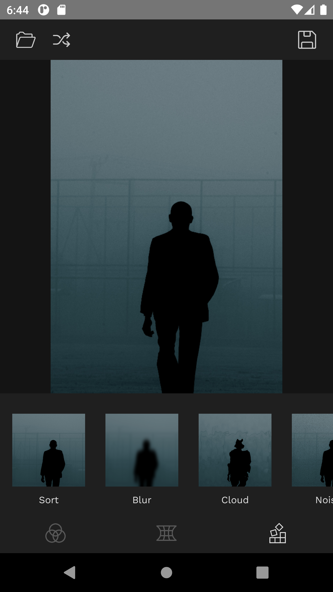

# Interactive image processing for Android

## What is this app for?

With GlitchIO you can apply effects to photos and images and transform then in various creative ways. The app offers effects in 3 categories: color manipulation effects, displace effects and digital processign effects.

## User Interface

The user interface is divided into sections to make the navigation and flow easier.
The top bar allows the user to open and save images. A ranomized effect can be applied by pressing the arrow button on top.
The bottom bar allows the user to select an effect and edit the effect using the parameter controls.

## Effects

#### Hue Shift
  &emsp; 

#### Hue Focus
  &emsp; 

#### Rainbow
  &emsp; 

#### Color Threshold 
  &emsp; 

#### Cloud
  &emsp; 
 
#### Wave
  &emsp; 

#### Triangle
  &emsp; 

#### Hatch
  &emsp; 

#### Sort
  &emsp; 

